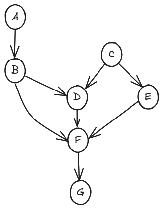
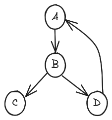
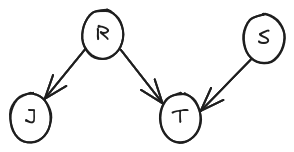
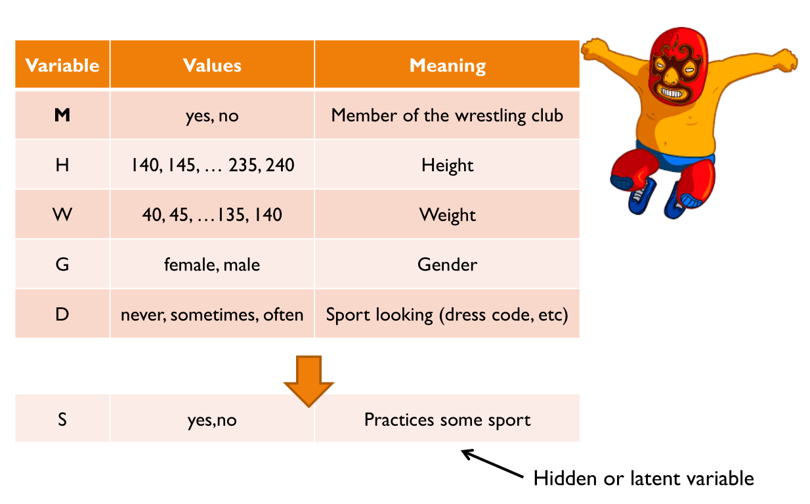
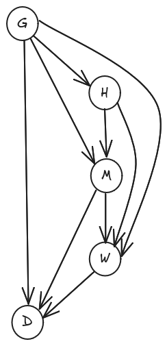
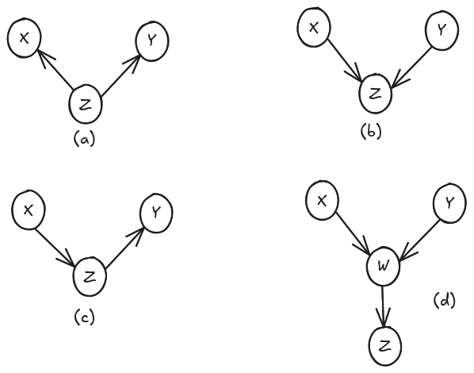
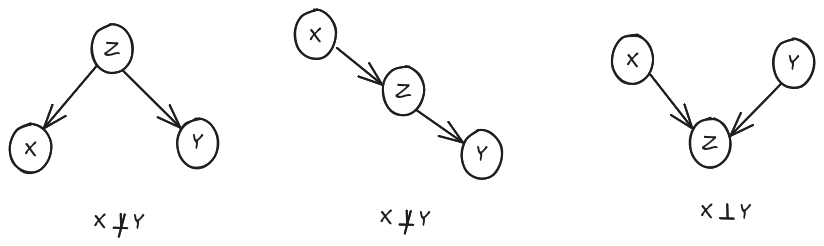
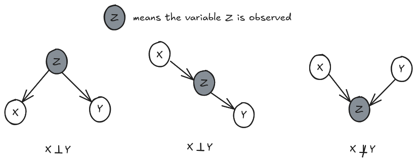
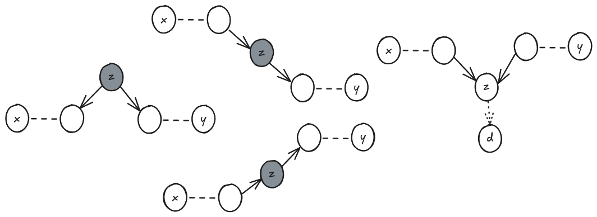
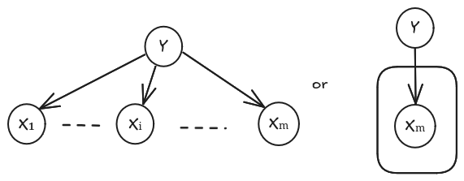

# Bayesian networks

## Bayesian networks as modeling tool

**Definition (Graph)**  
A graph $G$ consists of vertices (nodes) and edges (links) between the vertices. Edges may be directed or undirected. A graph with all edges directed is called a **directed graph**, whereas a graph with all edges undirected is called an **undirected graph**.

---

**Definition (Path, ancestors, descendants)**  
A **path** is a sequence of vertices that connects two nodes. The vertices $A$ such that $A \to B$ and $B \not\to A$ are the **ancestors** of $B$. The vertices $B$ such that $A \to B$ and $B \not\to A$ are the **descendants** of $A$.

---

**Definition (DAG)**  
A **directed acyclic graph** (DAG) is a graph $G$ with directed edges on each link between the vertex, such that by following a path from one node to another along the direction of each edge, no vertex will be revisited.  
The figure below illustrates a DAG and a non-DAG:

  

  

---

**Definition (Bayesian network)**  
A DAG whose vertices $\mathbf{X} = \{X_i|1 \leq i \leq n\}$ are random variables is a Bayesian network if and only if the joint distribution over $\mathbf{X}$ is of the form:

$$
p(x_1, \dots, x_n) = \prod_{i=1}^{n} p(x_i|\text{parents}(x_i))
$$

Not every model necessarily has a Bayesian Network (BN) representation, but many probabilistic models can be structured as a BN if they satisfy certain conditions. The fewer arcs, the more independent relationships.

---

**Example (Joint distribution of DAG)**  
Let’s consider a DAG as in the figure above.

$$
\begin{align}
p_{A, \dots, G}(a, b, \dots, g)
&= p_A(a) \times p_{B|A=a}(b) \times p_C(c) \\\\
& \times p_{D|B=b,C=c}(d) \times p_{E|C=c}(e) \\\\
& \times p_{F|B=b,D=d,E=e}(f) \times p_{G|F=f}(g)
\end{align}
$$

---

**Example (Wet Grass)**  
One morning, Teresie leaves her house and realizes that her grass is wet. Is it due to overnight rain, or did she forget to turn off the sprinkler last night?  
Next, she notices that the grass of her neighbor, Jack, is also wet. This explains away, to some extent, the possibility that her sprinkler was left on, and she concludes that it has probably been raining.

We define the variables:

- $R \in \{0,1\}$: $R=1$ means it has rained.  
- $S \in \{0,1\}$: $S=1$ means Teresie forgot to turn off the sprinkler.  
- $J \in \{0,1\}$: $J=1$ means Jack’s grass is wet.  
- $T \in \{0,1\}$: $T=1$ means Teresie’s grass is wet.  

We are interested in the joint probability $P(T, J, R, S)$. The order of variables is irrelevant.

$$
\begin{align}
P(T, J, R, S)
&= P(T|J, R, S) \cdot P(J, R, S) \\\\
&= P(T|J, R, S) \cdot P(J|R, S) \cdot P(R, S) \\\\
&= P(T|J, R, S) \cdot P(J|R, S) \cdot P(R|S) \cdot P(S)
\end{align}
$$

Since each variable is binary, we naively have to specify $2^4 = 16$ states.  
However, using normalization, we reduce this number.

- $P(T|J, R, S)$: 8 values (normalization gives the other 8)  
- $P(J|R, S)$: 4 values  
- $P(R|S)$: 2 values  
- $P(S)$: 1 value  

Total: **15 values**

In general, for $n$ binary variables, we need to specify $2^n - 1$ values.  
A drawback is that this grows exponentially, making it impractical for large $n$.
## Conditional Independence

We often know constraints of the system. This leads to making **conditional independence** assumptions.

### Example

For example, in the example of wet grass, we may assume that Tracy's grass being wet depends only directly on whether or not it has been raining and whether or not the sprinkler was on.  
That is, we write:

$$
P(T|J, R, S) = P(T|R, S)
$$

Since whether or not Jack's grass is wet is influenced only directly by whether or not it has been raining, we write:  

$$
P(J|R, S) = P(J|R)
$$

Since the rain is not directly influenced by the sprinkler, we also have:  

$$
P(R|S) = P(R)
$$

This means our model now simplifies to:  

$$
P(T, J, R, S) = P(T|R, S) \cdot P(J|R) \cdot P(R) \cdot P(S)
$$

We can represent this condition graphically as in the figure below.

  

This reduces the number of values that we need to specify to:  
**$4 + 2 + 1 + 1 = 8$**, a significant saving over the 15 values required when no conditional independence had been assumed.

To complete the model, we need to numerically specify the values of each **conditional probability table (CPT)**. The prior probabilities for $R$ and $S$ will be given by values like $P(R=1)$, $P(S=1)$, $P(J=1|R=1)$, $P(J=0|R=0)$, etc.

---

## Free Parameters

Number and cardinality of parents mostly determine the model complexity, e.g., in the discrete case:

$$
\text{number of free params} = \sum_{i=1}^{n} (|V_i| - 1) \prod_{V \in \text{parent}(V_i)} |V|
$$

### Example: Wrestling Club

Let's compute the number of free parameters from the wrestling club example. The DAG is given in the figure below.

  

  

| Variable name | Number of values | Number of parent value combinations | Size of CPT      |
|---------------|------------------|-------------------------------------|------------------|
| G             | 2                | 1                                   | $1 \times 1 = 1$ |
| H             | 20               | 2                                   | $19 \times 2 = 38$ |
| M             | 2                | $2 \times 20$                       | $1 \times 40 = 40$ |
| W             | 20               | $2 \times 2 \times 20 = 80$        | $19 \times 80 = 1520$ |
| D             | 3                | $2 \times 2 \times 20 = 80$        | $2 \times 80 = 160$ |
| **Total**     |                  |                                     | **1759**         |

This leads to **1759** values instead of  
$2400 = 1 \times 20 \times 2 \times 20 \times 3$.

But this is still not great because with insufficient data to estimate all the parameters in a Bayesian network, it can lead to unreliable conditional probability table (CPT) estimates. With too many parameters and sparse data, many combinations of parent values may not appear in the dataset, causing missing entries in the CPTs and increasing the risk of overfitting. This makes the model less reliable and reduces its ability to generalize to new data.

---

### A Better Solution

One solution is to use **continuous random variables** and assume parameterized distributions.

For example:  

$$
H|G = g \sim \mathcal{N}(\mu_g, \sigma_g^2)
$$  

This involves 4 parameters: $\mu_m, \sigma_m^2, \mu_f, \sigma_f^2$ (m for male and f for female).

For continuous parents, introduce parameterized dependency with them. For instance:  

$$
W|G = g, H = h, M = m \sim \mathcal{N}(\mu_{g,m}^0 + \mu_{g,m}^0 h, \sigma_{g,m}^{2^0} + \sigma_{g,m}^{2^0} h)
$$

This involves **16 parameters**: $\mu_{g,m}^0, \sigma_{g,m}^{2^0}$ for $g \in \{m,f\}$ and $m \in \{y,n\}$ (where $y$ stands for yes and $n$ for no).

So, we reduced the number of parameters and prevent overfitting:  
**$4 + 16$ instead of $38 + 1520$ parameters**.

## Inference

Now that we've defined a model, we can perform inference.

> **Example**  
> Let's come back to the wet grass example and derive the probability that the sprinkler was on overnight, given that Tracey's grass is wet:  
>  
> $$
> p(S = 1 | T = 1) = \frac{p(S = 1, T = 1)}{p(T = 1)}  
> = \frac{\sum_{J,R} p(T = 1, J, R, S = 1)}{\sum_{J,R,S} p(T = 1, J, R, S)}  
> = \frac{\sum_{J,R} p(J|R)p(T = 1|R, S = 1)p(R)p(S = 1)}{\sum_{J,R,S} p(J|R)p(T = 1|R, S)p(R)p(S)}  
> = \frac{\sum_{R} p(T = 1|R, S = 1)p(R)p(S = 1)}{\sum_{R,S} p(T = 1|R, S)p(R)p(S)}
> $$
>
> Now let us derive the probability that Tracey's sprinkler was on overnight, given that her grass is wet **and** that Jack’s grass is also wet, i.e., $p(S = 1 | T = 1, J = 1)$:  
>
> $$
> p(S = 1 | T = 1, J = 1) = \frac{p(S = 1, T = 1, J = 1)}{p(T = 1, J = 1)}  
> = \frac{\sum_{R} p(T = 1, J = 1, R, S = 1)}{\sum_{R,S} p(T = 1, J = 1, R, S)}  
> = \frac{\sum_{R} p(J = 1|R)p(T = 1|R, S = 1)p(R)p(S = 1)}{\sum_{R,S} p(J = 1|R)p(T = 1|R, S)p(R)p(S)}
> $$

---

## Conditional Independence in Bayesian Networks and Its Rules

A Bayesian network (BN) corresponds to a set of conditional independence assumptions. It is not always immediately clear from the DAG whether variables are conditionally independent.

### Definition: Conditional Independence

Let $\mathcal{X}$, $\mathcal{Y}$, and $\mathcal{Z}$ be sets of random variables. We say that $\mathcal{X}$ is conditionally independent of $\mathcal{Y}$ given $\mathcal{Z}$, denoted:

$$
\mathcal{X} \perp \mathcal{Y} | \mathcal{Z}
$$

if and only if:

$$
P(\mathcal{X}, \mathcal{Y} | \mathcal{Z}) = P(\mathcal{X} | \mathcal{Z}) P(\mathcal{Y} | \mathcal{Z})
$$

If they are not conditionally independent, we write:

$$
\mathcal{X} \not\perp \mathcal{Y} | \mathcal{Z}
$$

### Definition: Collider

In a Bayesian network, a **collider** is a node where two or more arrows collide (e.g., $X \rightarrow Z \leftarrow Y$). In this case:

- In graphs (a) and (c), $Z$ is **not a collider**: $X \perp Y | Z$.
- In graphs (b) and (d), $Z$ is a **collider**: $X \not\perp Y | Z$.

  

### Independence Rules (Unobserved $Z$)

When variable $Z$ is **not observed**, the following diagram explains independence:

  

### Independence Rules (Observed $Z$)

When variable $Z$ **is observed**, we use:

  

---

### Definition: d-Connection and d-Separation

If $G$ is a directed graph and $\mathcal{X}$, $\mathcal{Y}$, and $\mathcal{Z}$ are disjoint variable sets:

- $\mathcal{X}$ and $\mathcal{Y}$ are **d-connected** by $\mathcal{Z}$ if there's an undirected path $U$ such that:
  - Every collider $C$ on $U$ has $C \in \mathcal{Z}$ or a descendant in $\mathcal{Z}$.
  - No non-collider on $U$ is in $\mathcal{Z}$.
- Otherwise, they are **d-separated** by $\mathcal{Z}$.

Alternatively, a path $U$ is **blocked** if there's a node $w$ such that:

1. $w$ is a **collider**, and neither $w$ nor any of its descendants are in $\mathcal{Z}$, or  
2. $w$ is **not a collider** and $w \in \mathcal{Z}$.

If all paths between $\mathcal{X}$ and $\mathcal{Y}$ are blocked, then:

$$
\mathcal{X} \perp \mathcal{Y} | \mathcal{Z}
$$

  

If $\mathcal{X}$ and $\mathcal{Y}$ are d-separated by $\mathcal{Z}$, they are conditionally independent in **all** distributions compatible with the DAG.

---

**Note:** A Bayesian network encodes **independence**, not causality.

---

## Bayesian Networks and Causality

In BNs, a variable $A$ is (imperfectly) said to cause $B$ if:

- $A$ and $B$ are strongly dependent conditionally on all other variables.
- $A$ temporally precedes $B$ (unless $B$ anticipates $A$).

Although real-world phenomena can often be modeled causally, BNs mostly represent **statistical dependencies**, not **causal relationships**.

## Learning from complete data: MLE of Bayesian network

In this section, we illustrate how to compute the MLE for CPT. We demonstrate the property that the MLE of a Bayesian network is the union of MLE applied to BN factors (i.e., CPT) separately.

Let a BN whose variables are $\mathcal{X} = (X_1, \dots, X_m)$, $\theta_i$ parameters of $p_{X_i|\text{parents}(X_i)}$, $\mathcal{D} = \{ x_j | 1 \leq j \leq n \}$ be a set of i.i.d samples with $x_j = (x_{1j}, \dots, x_{mj})$.

To find the MLE of the parameters in a Bayesian network, we differentiate the log-likelihood function with respect to each parameter and set it to zero, leading to the following condition:

$$
\frac{\partial \mathcal{L}(\mathcal{D}; \theta)}{\partial \theta} = 0 \Leftrightarrow \forall k, \quad \frac{\partial \mathcal{L}(\mathcal{D}; \theta_k)}{\partial \theta_k} = 0
$$

We have:

$$
\begin{align}
p(\mathcal{D}|\theta) &= \prod_{j=1}^n p(x_j|\theta) \\\\
&= \prod_{j=1}^n \prod_{i=1}^m p_{X_i|\text{parents}(X_i), \theta_i}(x_{ij})
\end{align}
$$

Thus,

$$
\log p(\mathcal{D}|\theta) = \sum_{j=1}^n \sum_{i=1}^m \log p_{X_i|\text{parents}(X_i), \theta_i}(x_{ij})
$$

We have $\forall k$:

$$
\begin{align}
\frac{\partial \log p(\mathcal{D}|\theta)}{\partial \theta_k} 
&= \sum_{j=1}^n \sum_{i=1}^m \frac{\partial}{\partial \theta_k} \log p_{X_i|\text{parents}(X_i), \theta_i}(x_{ij}) \\\\
&= \sum_{j=1}^n \frac{\partial}{\partial \theta_k} \log p_{X_k|\text{parents}(X_k), \theta_k}(x_{kj}) \\\\
&= \frac{\partial}{\partial \theta_k} \left( \sum_{j=1}^n \log p_{X_k|\text{parents}(X_k), \theta_k}(x_{kj}) \right) \\\\
&= \frac{\partial}{\partial \theta_k} \left( \sum_{j=1}^n \log \mathcal{L}(x_j; \theta_k) \right) \\\\
&= \frac{\partial \log \mathcal{L}(\mathcal{D}; \theta_k)}{\partial \theta_k}
\end{align}
$$

## Bayesian inference in Bayesian networks

Here we demonstrate that if priors of BN factors are independent, posteriors of BN factors are also independent.

We suppose that the priors of the BN factors are independent:

$$
p(\theta)=\prod_{i=1}^m p(\theta_i)
$$

Then,

$$
\begin{align}
p(\theta|\mathcal{D})
    &\propto \mathcal{L}(\mathcal{D}; \theta) \\
    &\propto \left(\prod_{j=1}^n \prod_{i=1}^m p_{X_i|\text{parents}(X_i),\theta_i}(x_{ij})\right) \times \left(\prod_{i=1}^m p(\theta_i)\right) \\
    &\propto \prod_{i=1}^m \left(\left(\prod_{j=1}^n  p_{X_i|\text{parents}(X_i),\theta_i}(x_{ij})\right) \times p(\theta_i)\right) \\
    &\propto \prod_{i=1}^m \mathcal{L}({\mathcal{D}; \theta_i}) \times p(\theta_i) = \prod_{i=1}^m p({\theta_i|\mathcal{D}})
\end{align}
$$

Hence, Bayesian inference can be applied to variables one after the other.

## Naive Bayes

Naive Bayes is a generative approach which assumes the features $X_i$ are conditionally independent given the class label:

$$
\forall i \text{,} \forall j \text{,} X_i \perp X_j|Y
$$

We illustrate the Naive Bayes graph model in the figure below.

  

Naive Bayes graph model: $k-1+2km$ parameters

This allows us to write the class conditional density as a product of one-dimensional densities:

$$
p(X,Y=c)=p(y=c) \prod_{i=1}^m p(x_i|y=c)
$$

With parameters $\theta$, we have:

$$
p(X,Y=c, \theta)=p(y=c, \theta) \prod_{i=1}^m p(x_i|y=c, \theta_{ic})
$$

The model is called **naive** since we do not expect the features to be independent, even conditional on the class label. However, even if the naive Bayes assumption is not true, it often results in classifiers that work well. One reason for this is that the model is quite simple (it only has $O(C \times m)$ parameters, for $C$ classes and $m$ features), and hence it is relatively immune to overfitting.

We compute the prediction of $Y$ for a novel attribute $X^\ast$ as follows:

$$
p(Y | X^\ast, \theta) = \frac{p(X^\ast | Y, \theta)}{p(X^\ast | \theta)} p(Y | \theta) \propto \left( \prod_{i=1}^m p(X_i^\ast | Y, \theta) \right) \times p(Y | \theta)
$$

This leads to:

$$
p(Y=c|X^\ast, \theta) \propto \left(\prod_{i=1}^m p(X_i^\ast|Y=c, \theta) \right) \times p(Y=c|\theta)
$$

- In the case of **real-valued features**, we can use the Gaussian distribution:

$$
p(X|Y=c,\theta)=\prod_{j=1}^m \mathcal{N}(X_i|\theta_{jc}, \sigma_{jc}^2)
$$

where $\theta_{jc}$ is the mean of feature $j$ when the class label is $c$, and $\sigma_{jc}^2$ is its variance.

- In the case of **binary features**, $x_j \in \{0, 1\}$, we can use the Bernoulli distribution:

$$
p(X|Y=c,\theta)=\prod_{j=1}^m \text{Ber}(x_j|\theta_{jc})
$$

  where $\theta_{jc}$ is the probability that feature $j$ occurs in class $c$.

- In the case of **categorical features**, we can use the multinoulli distribution:

$$
p(X|Y=c,\theta)=\prod_{j=1}^m \text{Cat}(X_j|\theta_{jc})
$$

  where $\theta_{jc}$ is the histogram over the $m$ possible values for $X_j$ in class $c$.

### Model fitting

We now discuss how to train a naive Bayes classifier. This usually means computing the MLE or the MAP estimate for the parameters.

<!-- In the **discrete case**, with categorical features, parameters are:

- CPT of $Y$: class priors $(\pi_c)_{1 \leq c \leq C} = p(Y=c)$
- CPT of $(X_i)_{1 \leq i \leq m}: p(X_i=v_i|Y=c, \theta_i)$ -->

The probability for a single data case is given by:

$$
p(x_i, y_i | \theta) = p(y_i | \pi) \prod_{j=1}^m p(x_{ij} | \theta_j) = 
\prod_{c=1}^C \pi_c^{\mathbf{1}(y_i = c)} \prod_{j=1}^m \prod_{c=1}^C p(x_{ij} | \theta_{jc})^{\mathbf{1}(y_i = c)}
$$

Hence, the log-likelihood is given by:

$$
\begin{align}
\log p(\mathcal{D} | \theta)
&= \sum_{c=1}^{C} \sum_{i=1}^N \mathbf{1}(y_i = c) \log \pi_c + \sum_{j=1}^{m} \sum_{c=1}^{C} \sum_{i:y_i = c} \log p(x_{ij} | \theta_{jc}) \\
&= \sum_{c=1}^{C} N_c \log \pi_c + \sum_{j=1}^{m} \sum_{c=1}^{C} \sum_{i:y_i = c} \log p(x_{ij} | \theta_{jc})
\end{align}
$$

where $N_c = \sum_{i} \mathbf{1}(y_i = c)$ is the number of examples in class $c$.

We see that this expression decomposes into a series of terms, one concerning $\pi$, and $mC$ terms containing the $\theta_{jc}$'s. Hence, we can optimize all these parameters separately.

The MLE for the class prior is given by:

$$
\hat{\pi}_c = \hat{p}(Y=c) = \frac{N_c}{N}
$$

The MLE for the likelihood depends on the type of distribution we choose to use for each feature.

- In the case of discrete features, we use categorical distribution and the MLE becomes:

  $$
  \hat{\theta}_{jc}(v) = p(X_j=v|Y=c) = \frac{N _{jc}(v)}{N_c}
  $$

  where

  $$
  N_{jc}(v)=\sum_{i=1}^N \mathbf{1}(y_i=c)\mathbf{1}(x_{ij}=v)
  $$

- In the case of binary features, the categorical distribution becomes the Bernoulli and the MLE becomes:

  $$
  \hat{\theta}_{jc} = p(X_j=1|Y=c) = \frac{N _{jc}}{N_c}
  $$

  which is the empirical fraction of times that feature j is on in examples of class c, where

  $$
  N_{jc}=\sum_{i=1}^N \mathbf{1}(y_i=c)\mathbf{1}(x_{ij}=1)
  $$

- In the case of real-valued features, we can use a Gaussian distribution and the MLE is:

  $$
  \hat{\theta}_{jc} = \frac{1}{N_c}\sum_{i:y_i=c} x_{ij}
  $$

  $$
  \hat{\sigma}^2_{jc} = \frac{1}{N_c} \sum_{i:y_i=c} (x_{ij}-\hat{\theta}_{jc})^2
  $$

It is extremely simple to implement this model fitting procedure. The Naive Bayes algorithm takes $O(nm)$ time. The method is easily generalized to handle features of mixed type. This simplicity is one reason the method is so widely used.

---

MAP and Bayesian inference are not typically useful for Naive Bayes in most cases because Naive Bayes already makes strong independence assumptions between features, which simplifies the model and often leads to sufficiently accurate predictions with just the Maximum Likelihood Estimation (MLE) of parameters.

In Naive Bayes, we assume that the features are conditionally independent given the class, and thus, the likelihood of the data can be computed independently for each feature. Adding a prior distribution (as in MAP or full Bayesian inference) does not often improve the model's performance, because the parameter estimation is already fairly straightforward with MLE and does not require incorporating complex priors or posterior updates. Furthermore, in many practical applications, the computational cost of performing full Bayesian inference is not justified, especially when the data is large and the model's simplicity through MLE is already effective.

### The log-sum-exp trick

When working with generative classifiers or models involving probability distributions, one common challenge is numerical stability, particularly when dealing with very small probabilities. This can lead to issues like underflow or overflow, especially in high-dimensional spaces, where the likelihood function might involve the product of many small probabilities.

To mitigate this, it is often beneficial to use the log of the likelihood function. Taking the logarithm of probabilities helps transform very small numbers into more manageable ones, making the computation numerically stable. This can be achieved by computing the log-likelihood:

$$
\log \mathcal{L}(\mathcal{D};\theta) = \sum_{i=1}^{n} \log \mathcal{L}(x_i;\theta)
$$

This log transformation converts the product of probabilities into a sum of logs, which is much less prone to numerical instability. The log-likelihood is often maximized in practice, as we are typically interested in finding the parameter values $\hat{\theta}_{\text{mle}}$ that maximize this quantity:

$$
\hat{\theta}_{\text{mle}} = \arg \max_{\theta} \log \mathcal{L}(\mathcal{D};\theta)
$$

This approach effectively addresses the issue of underflow by ensuring that the likelihood computation stays within a stable numerical range.

While transforming the likelihood into a log-likelihood helps prevent underflow, there are still other potential numerical issues, such as overflow, which can occur when working with large numbers. In situations where the arguments of an exponential function are extremely large (either very positive or very negative), we may encounter overflow or underflow errors. For instance, consider the softmax function, which is commonly used in classification tasks to compute probabilities from logits:

$$
\hat{p}_i = \frac{\exp(z_i)}{\sum_{j=1}^{n} \exp(z_j)}
$$

Here, the numerator and denominator involve exponentiating the values of $z_i$. If the values of $z_i$ are too large or too small, the exponential function can produce values that exceed the limits of the floating-point representation, leading to overflow or underflow. For example, if $z_i$ is very large, the exponential term can become larger than the largest number representable in the system, causing overflow. Conversely, if $z_i$ is very negative, the result of the exponential term can become so small that it results in underflow.

To deal with this, we can apply a technique known as the **max trick**, which involves subtracting the maximum value from all the entries before computing the exponentials:

$$
\hat{p}_i = \frac{\exp(z_i - \max_j z_j)}{\sum_{j=1}^{n} \exp(z_j - \max_k z_k)}
$$

This trick ensures that the largest exponent is zero, thus preventing overflow, while the differences between all the terms remain the same. This transformation keeps the values within a numerically stable range. Additionally, this ensures that the exponentials remain well-behaved and the probabilities do not exceed 1 or become numerically unstable.

In many machine learning algorithms, especially when computing sums over exponentials of many terms, such as in Bayesian inference or softmax computations, the log-sum-exp trick is widely used. The key idea is to avoid directly computing sums in the exponential domain, which can lead to significant precision errors when adding up small numbers. The **log-sum-exp** trick involves factoring out the largest term in the sum and representing the remaining terms relative to it.

For a set of probabilities $\{p_i\}_{1 \leq i \leq n}$, we can use both of the methods:

$$
\begin{align}
p_i &\rightarrow \log(p_i) \quad \text{(log trick)} \\
&\rightarrow \log(p_i) - \max_i(\log(p_i) \quad \text{(max trick)} \\
&\rightarrow \frac{e^{\log(p_i) - \max_i(\log(p_i)}}{\sum_{i=1}^n e^{\log(p_i) - \max_i(\log(p_i)}} \quad \text{(exp and sum trick)}
\end{align}
$$
