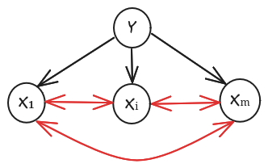

# Gaussian Discriminant Analysis

> [!Note]
> Here is my [PDF note](https://bmalick.github.io/machine-learning-grind/03-gda.pdf)

Gaussian discriminant analysis (GDA) is a generative classifier. Compared to Naive Bayes, GDA is restricted to continuous features and assumes features are normally distributed within classes, i.e.,

$$
p(X|y=c,\theta)=\mathcal{N}(X|\mu_c, \Sigma_c)
$$

If $\Sigma_c$ is diagonal, this is equivalent to Naive Bayes. With  

$$
k-1 + k\left(m + \frac{m(m+1)}{2}\right)
$$

parameters, GDA has more parameters than Naive Bayes ($k - 1 + 2km$ parameters). Thus, it is more accurate but the risk of overfitting is higher.

  

Quadratic discriminant analysis has $k-1+k\left(m+\frac{m(m+1)}{2}\right)$ parameters

As,

$$
p(Y = c | X, \theta) = \frac{p(Y = c | \theta) p(X | Y = c, \theta)}{p(X |\theta)}
$$

we can classify a feature vector using the following decision rule:

$$
\hat{y}(x) = \arg\max_c \left[ \log p(y = c | \pi) + \log p(x | \theta_c) \right]
$$

## Multivariate Normal

The pdf for an MVN in $D$ dimensions is defined by:

$$
\mathcal{N}(x | \mu, \Sigma) = \frac{1}{(2\pi)^{D/2} |\Sigma|^{1/2}} \exp \left( -\frac{1}{2} (x - \mu)^T \Sigma^{-1} (x - \mu) \right)
$$

The expression inside the exponent is the **Mahalanobis distance** between a data vector $x$ and the mean vector $\mu$. The first two moments are:

$$
\mathbb{E}(X)=\mu \quad \text{and} \quad \text{cov}(X)=\mathbb{E}((X-\mu)(X-\mu)^T)
$$

If we have $N$ i.i.d. samples $x_i \sim \mathcal{N}(\mu, \Sigma)$, then the MLE for the parameters is:

$$
\hat{\mu}_ {\text{mle}} = \frac{1}{N} \sum_{i=1}^N x_i = \bar{x}
$$

$$
\hat{\Sigma}_ {\text{mle}} = \frac{1}{N} \sum_{i=1}^N (x_i - \bar{x})(x_i - \bar{x})^T = \frac{1}{N} \sum_{i=1}^N x_i x_i^T - \bar{x} \bar{x}^T
$$

## MLE for Discriminant Analysis

The log-likelihood function is:

$$
\log p(\mathcal{D} | \theta)
= \left[\sum_{i=1}^{N}\sum_{c=1}^{C} \mathbb{1}(y_i = c) \log \pi_c\right] + \sum_{c=1}^{C}\left[\sum_{i:y_i = c} \log \mathcal{N}(X|\mu_c, \Sigma_c)\right]
$$

This factorizes into a term for $\pi$, and $C$ terms for each $\mu_c$ and $\Sigma_c$. Thus we can estimate parameters separately:

- Class prior:  

$$
\hat{\pi}_ c = \frac{N_c}{N}, \quad \text{where } N_c = \sum_{i} \mathbb{1}(y_i = c)
$$

- Class-conditional means and covariances:

$$
\hat{\mu}_ c = \frac{1}{N_c} \sum_{i: y_i = c} x_i = \frac{1}{N_c} \sum_{i=1}^N \mathbb{1}(y_i = c) x_i
$$

$$
\hat{\Sigma}_ c = \frac{1}{N_c} \sum_{i: y_i = c} (x_i - \hat{\mu}_ c)(x_i - \hat{\mu}_ c)^T = \frac{1}{N_c} \sum_{i=1}^N \mathbb{1}(y_i = c) (x_i - \hat{\mu}_ c)(x_i - \hat{\mu}_ c)^T
$$

## Quadratic Discriminant Analysis (QDA)

From the Bayes formula:

$$
p(Y = c | X, \theta) \propto \pi_c \frac{1}{|\Sigma_c|^{1/2}} \exp \left[ -\frac{1}{2} (x - \mu_c)^T \Sigma_c^{-1} (x - \mu_c) \right]
$$

This requires $\Sigma_c$ to be well conditioned.

Class boundaries between $c_1$ and $c_2$ are quadratic surfaces:

$$
\log(\pi_{c_1} |\Sigma_{c_1}|^{1/2}) - \frac{1}{2} (x - \mu_{c_1})^T \Sigma_{c_1}^{-1} (x - \mu_{c_1}) =
\log(\pi_{c_2} |\Sigma_{c_2}|^{1/2}) - \frac{1}{2} (x - \mu_{c_2})^T \Sigma_{c_2}^{-1} (x - \mu_{c_2})
$$

This is known as **Quadratic Discriminant Analysis (QDA)**.

## Linear Discriminant Analysis (LDA)

Now consider the special case where the covariance matrices are shared across classes (homoscedasticity): $\Sigma_c = \Sigma$.

Then:

$$
p(X|y=c,\theta)=\mathcal{N}(X|\mu_ c, \Sigma)
$$

LDA has fewer parameters: $k - 1 + km + \frac{m(m+1)}{2}$

The MLE for $\Sigma$ becomes:

$$
\hat{\Sigma} = \frac{1}{N} \sum_{c=1}^C \sum_{i:y_i=c} (x_i - \hat{\mu}_c)(x_i - \hat{\mu}_c)^T
$$

## Mahalanobis Distance and Transformation

We perform an eigendecomposition: $\Sigma = U \Lambda U^T$ where $U^T U = I$ and $\Lambda = \text{Diag}(\sigma_i^2)$.

Define the **Mahalanobis transformation**:

$$
\phi(x) = \Sigma^{-1/2} x = \text{Diag}(\sigma_i^{-1}) U^T x
$$

Then the Mahalanobis distance between $x_1$ and $x_2$ is:

$$
d_M(x_1,x_2)
= \sqrt{(x_1-x_2)^T \Sigma^{-1} (x_1-x_2)}
= \sqrt{(\phi(x_1)-\phi(x_2))^T (\phi(x_1)-\phi(x_2))}
$$

So:

$$
x \sim \mathcal{N}(0, \Sigma) \Rightarrow \phi(x) \sim \mathcal{N}(0, I)
$$

LDA classifies based on Mahalanobis distance to $\mu_c$:

$$
p(Y = c | X) \propto \pi_c |\Sigma^{-1}| \exp \left[-\frac{1}{2} d_M(X, \mu_c)^2 \right]
$$

### LDA Class Boundaries

LDA class boundaries are **hyperplanes**. Using the transformation $z = \phi(x)$, and referring to the earlier class boundary equation:

$$
z \in \text{boundary between class 1 and 2}
\iff \text{linear equation in } z
$$
