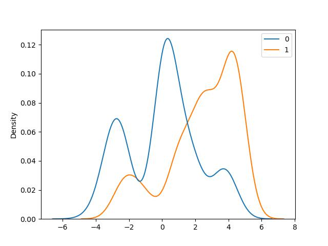
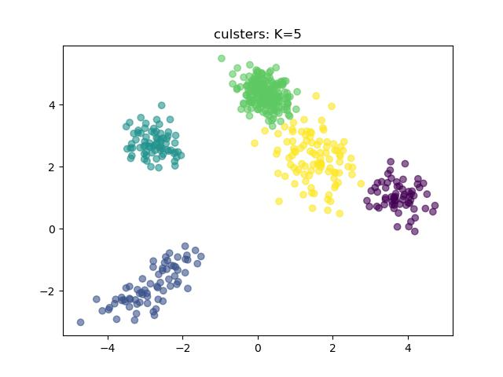
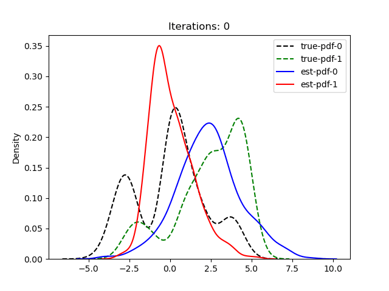
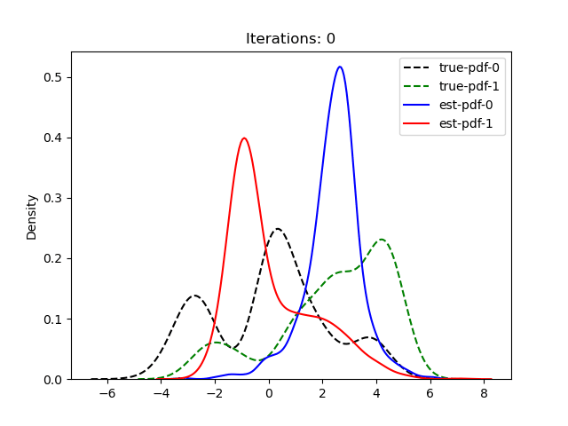
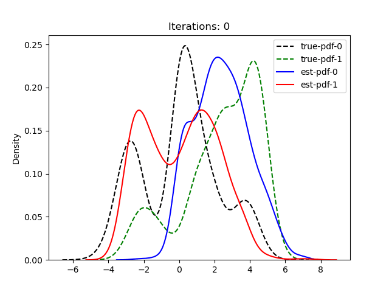

# EM Algorithm

## Gaussian mixture dataset

| | |
|:-:|:-:|
|  |  |

## Result of clustering

| | |
|:-:|:-:|
|  |  |
|  |  |
|  | |

## Evolution of pdf

| | |
|:-:|:-:|
|  |  |
|  |  |
|  | |

