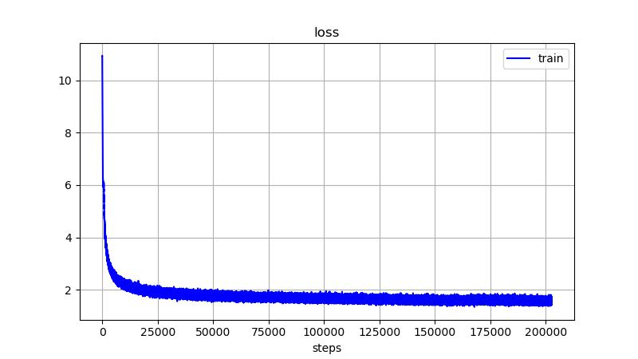
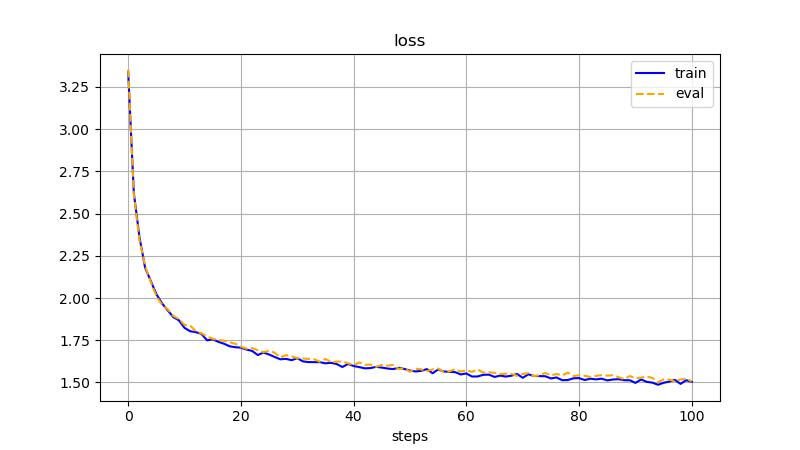
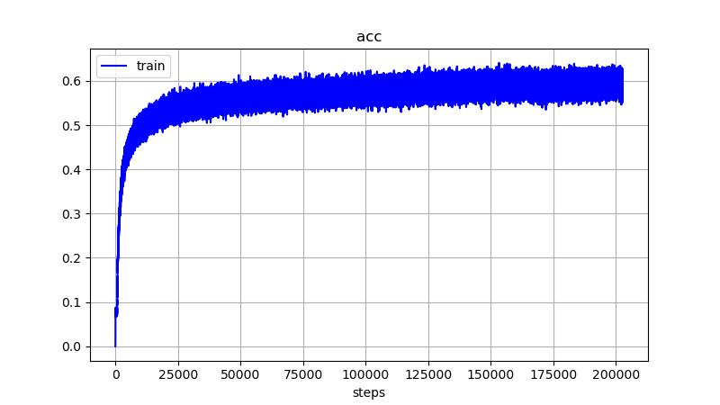
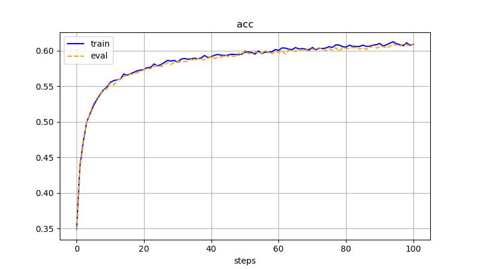

# GPT

**Paper**: [Improving Language Understanding by Generative Pre-Training](https://cdn.openai.com/research-covers/language-unsupervised/language_understanding_paper.pdf)

## Loss and metrics
| | |
|:---:|:---:|
|  |  |
|  |  |

## Ressources
- [Improving Language Understanding by Generative Pre-Training](https://cdn.openai.com/research-covers/language-unsupervised/language_understanding_paper.pdf)
- [d2l](https://d2l.ai/)
- [(Beta) Implementing High-Performance Transformers with Scaled Dot Product Attention (SDPA)](https://docs.pytorch.org/tutorials/intermediate/scaled_dot_product_attention_tutorial.html)
- [torch.nn.functional.scaled_dot_product_attention](https://docs.pytorch.org/docs/2.12/generated/torch.nn.functional.scaled_dot_product_attention.html#torch.nn.functional.scaled_dot_product_attention)
- [Karpathy nanoGPT](https://github.com/karpathy/nanogpt)

