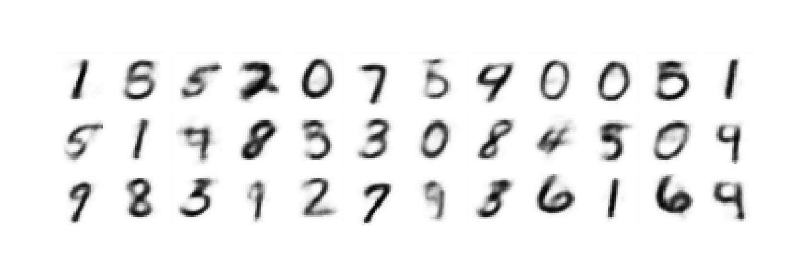
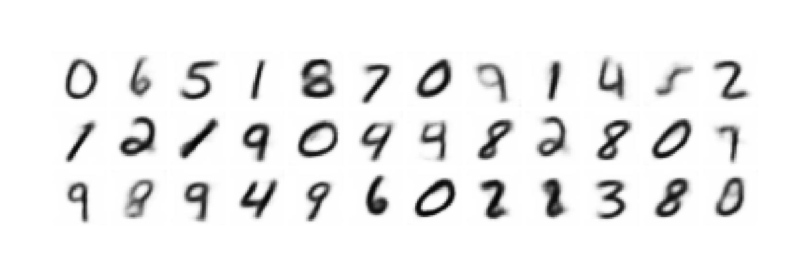
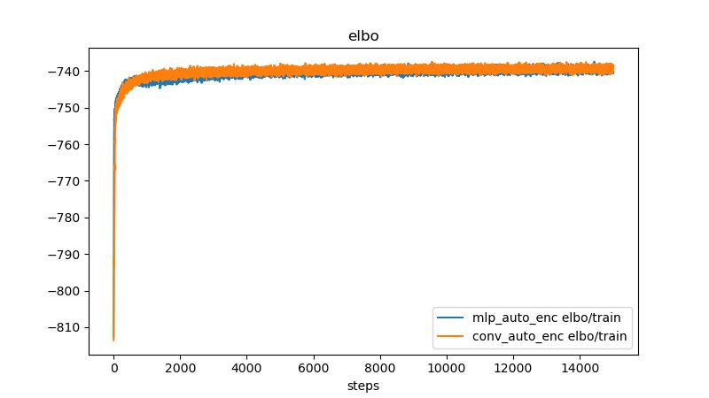
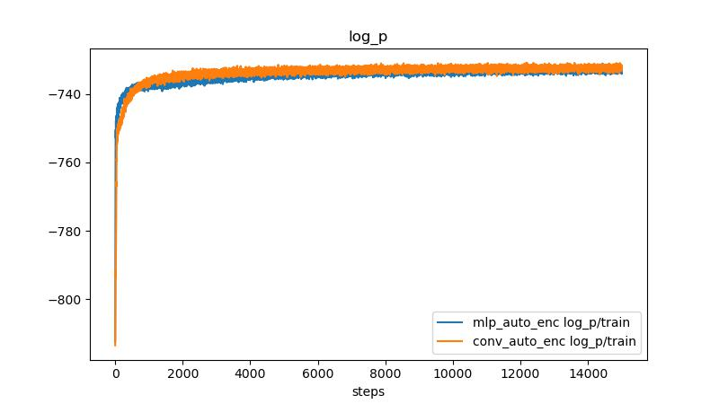
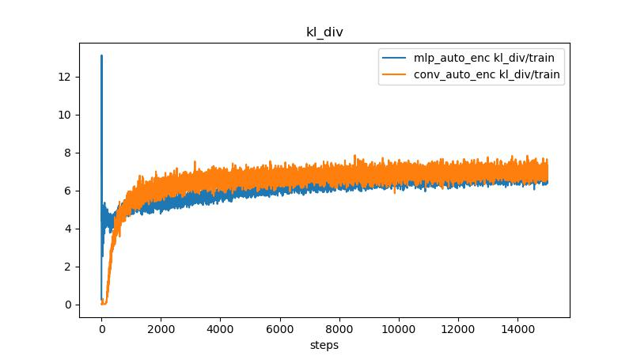

# VAE

[Auto-Encoding Variational Bayes](https://arxiv.org/abs/1312.6114)

## Generated digits

- MLP version which is closer to the one presented in the paper.

- Convolution layers verion

## Losses

