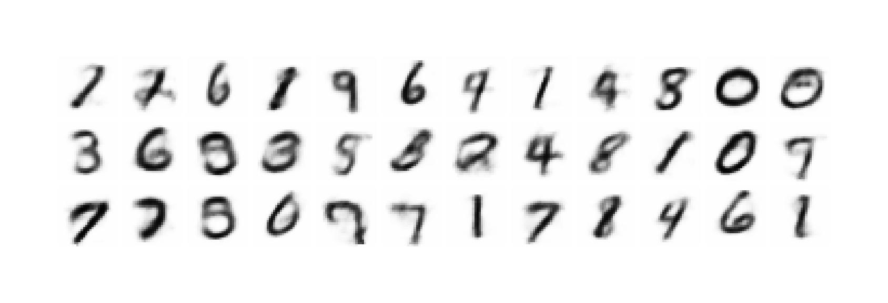
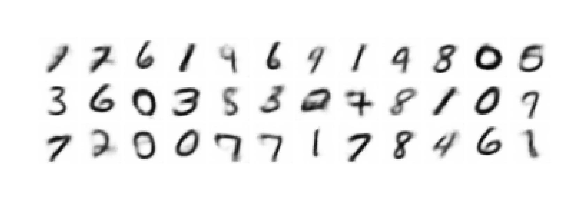
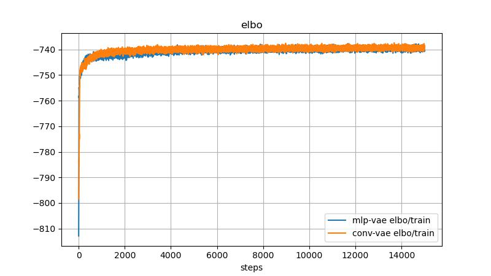
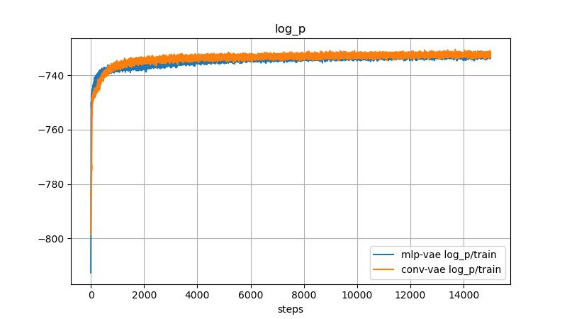
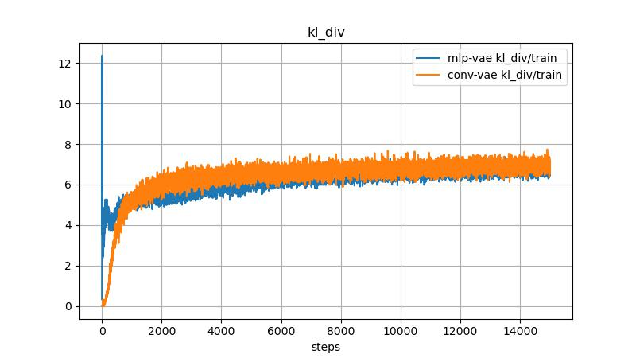

# VAE

[Auto-Encoding Variational Bayes](https://arxiv.org/abs/1312.6114)

## Generated digits

- MLP version which is closer to the one presented in the paper.

- Convolution layers verion

## Losses

| | |
|:---:|:---:|
|  |  |
|  | |

## Resources
- The original paper
- [Tutorial on Diffusion Models for Imaging and Vision](https://arxiv.org/abs/2403.18103)
- [Understanding Deep Learning](https://udlbook.github.io/udlbook/)

