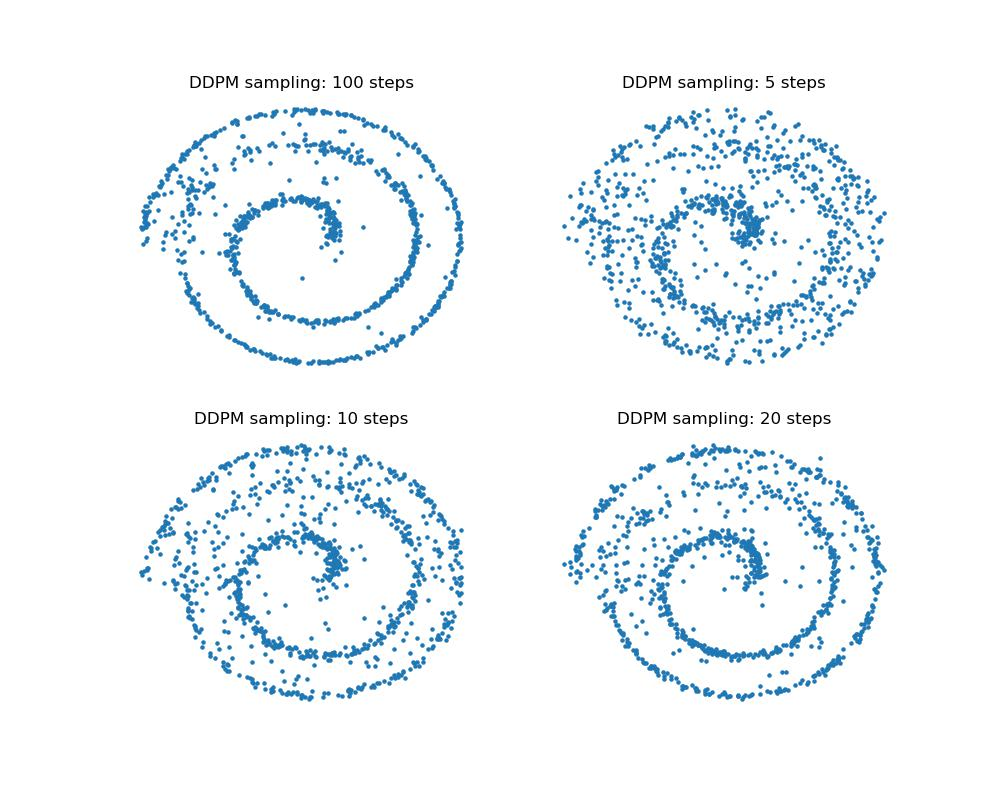
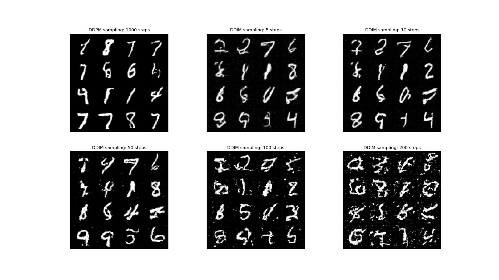

# DDIM

Original paper: [Denoising Diffusion Implicit Models](arxiv.org/abs/2010.02502)

## DDPM vs. DDIM on Fermat's Spiral dataset

## DDPM vs. DDIM on Mnist data

## Ressources
- The original paper
- [Tutorial on Diffusion Models for Imaging and Vision](https://arxiv.org/abs/2403.18103)
- [The Annotated Diffusion Model](https://huggingface.co/blog/annotated-diffusion)
- [Fermat's spiral](https://en.wikipedia.org/wiki/Fermat%27s_spiral)
